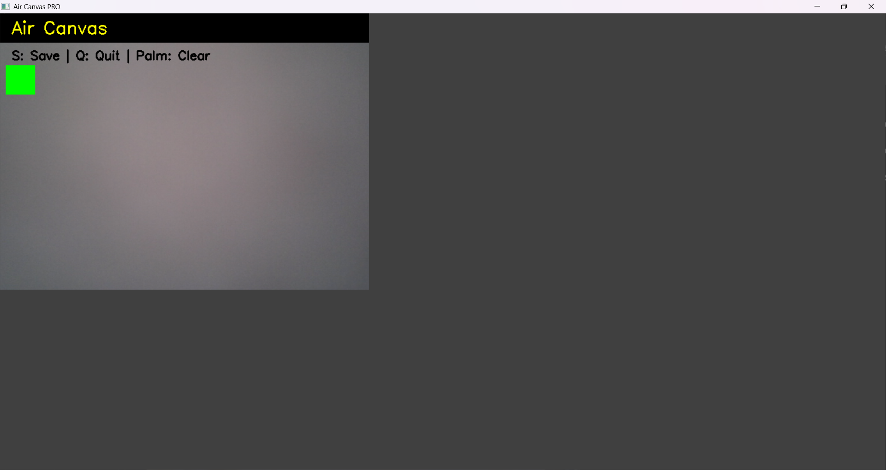
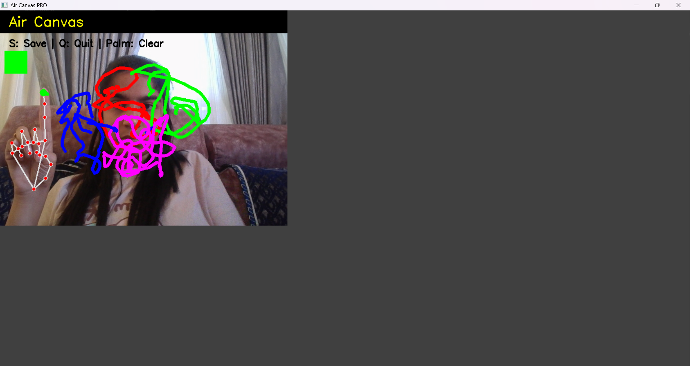

# 🖌 Air Canvas

**Air Canvas** is a **gesture-controlled virtual drawing application** built with **Python**, **OpenCV**, and **MediaPipe**.  
It allows users to **draw in the air using hand gestures**, change colors, clear the canvas, and save artwork — all in real-time.  

This project demonstrates **computer vision**, **hand tracking**, and **interactive user interface development** using Python.

---

## 📂 Project Description

The repository contains the following:

- `air_canvas.py` → Main Python script containing the full code to run the application.  
- `requirements.txt` → Contains all Python dependencies needed to run the project.  
- `screenshots/` → Folder containing example screenshots of the app and sample drawings.  

This project is designed to be easy to set up and run on any system with Python installed.

---

## 🖥 How It Works

1. The script captures webcam video using **OpenCV**.  
2. **MediaPipe** detects hand landmarks in real-time.  
3. Finger positions determine user actions: drawing, changing color, or clearing the canvas.  
4. The virtual canvas is created using **NumPy arrays**.  
5. Users can save their drawing (`S` key) or quit (`Q` key).  

---

## How to Use

1. Run the Python script to open your webcam.  
2. Use **hand gestures** as follows:  

| Action           | Gesture / Key        |
|-----------------|--------------------|
| Draw             | Index finger up 👆   |
| Change Color     | Index + Middle ✌    |
| Clear Canvas     | All fingers up ✋    |
| Save Drawing     | `S` key             |
| Quit             | `Q` key             |

3. Your drawing will appear on the screen in real-time.  
4. Press `S` to save the canvas as `air_canvas_drawing.png`.

---

## 📸 Results

### Application UI

### Sample Drawing

---

## 🔑 Key Insights / Features

- Real-time hand tracking for smooth drawing  
- Gesture controls for drawing, clearing canvas, and changing brush color  
- Minimal setup: single Python script + requirements.txt  
- Can be extended for AR/VR, interactive presentations, or accessibility projects  

---

## 🧰 Tools Used / Tech Stack

| Technology   | Purpose |
|--------------|---------|
| Python       | Core programming language |
| OpenCV       | Video capture & image processing |
| MediaPipe    | Hand detection & tracking |
| NumPy        | Canvas & array operations |

---

## 🌎 Use Cases / Real-World Applications

- **Digital Art & Sketching**: Draw without a physical tablet  
- **Interactive Presentations**: Annotate slides or whiteboards in real-time  
- **AR/VR Applications**: Control virtual objects using hand gestures  
- **Sign Language Recognition & Accessibility**: Gesture-based controls  
- **Touchless Interfaces**: Useful in hospitals or public kiosks  

---

## 👨‍💻 Author

**Rishitha Ravikumar**  
